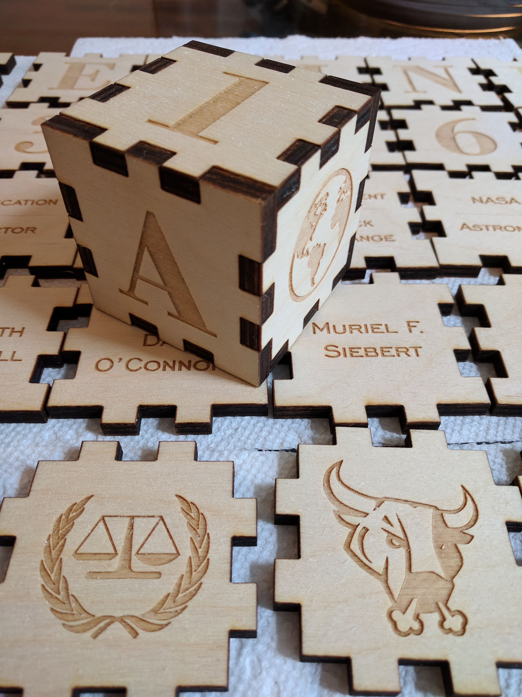

## Wood Blocks

Purpose: For my niece's first birthday I couldn't find many toys for baby girls that weren't tutus or dolls. I gave up on finding anything and created baby blocks featuring exceptional women in history. 

Material: Quarter inch birch plywood with mineral oil and beeswax because I wanted it safe for this to be chewed and thrown around. We use this process for our cutting boards as well. 

Machine: Cut on a Universal Systems laser cutter (100W) in 3 hours. It took longer because I outlined each object in a heavier black outline to make the images pop just a little more. It helped with the text more than the images.

 

 
 

 
 
 
 

 
 

 
 
 

 
 

